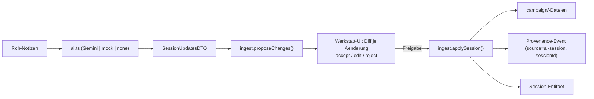

# Architektur

Ein Prozess, eine Sprache (TypeScript), Dateien als Wahrheit. So einfach wie möglich, so mächtig
wie nötig — passend zu einem privaten Heim-Server, der eine Kampagne über Jahre trägt.

## Überblick

- **Frontend + Backend in EINEM SvelteKit-Prozess.** SvelteKit 2 · Svelte 5 (Runes) · Tailwind 4 ·
  `@sveltejs/adapter-node` · PWA (`@vite-pwa/sveltekit`).
- **Kanonische Daten = Dateien** in `campaign/` (JSON + Markdown). Keine Datenbank. Git = Historie/Sync.
- **Live-Sync** über einen Datei-Watcher (chokidar) → `EventEmitter` → SSE → reaktive UI. Externe Edits
  (Claude Code, Obsidian) erscheinen sofort im laufenden Dashboard.
- **KI ist optional & steckbar** und schreibt nie ohne Freigabe.

```
Browser (Svelte 5 UI)  ──HTTP──▶  SvelteKit-Server-Routen (/api/*)
       ▲   │                              │
       │   └──── SSE /api/stream ◀──── EventEmitter ◀── chokidar-Watcher
       │                                  │
       └────────── reaktives rev++        ▼
                                    campaign/  (JSON + Markdown = Wahrheit)  ──▶ Git
```

## Datenschicht

`campaign/` ist die einzige Wahrheitsquelle:

```
campaign/
  meta.json                  Kampagnen-Meta + Campaign-State (name, location, situation, activeCharacterId)
  characters/<id>.json       vollständige 5e-Charakterbögen (mehrere möglich)
  inventory.json             Items  · quests.json  Quests  · prep.json  Session-Pläne
  sessions.json              Sessions als Entitäten (Provenance-Anker)
  knowledge.json             Wissen (Fakt/Gerücht/Theorie, Sicht, Quell-Session)
  chronicle.md               Chronik (Markdown, je Session ein Block)
  lore/{npcs,places,notes}/*.md   Glossar & Notizen mit Frontmatter + [[Wikilinks]]
  assets/                    Bilder (Porträts, Karten) → /api/assets/<datei>
  .history/                  generiert: events.jsonl (Event-Log), snapshots.json
```

**`lib/server/campaign.ts`** — die IO-Grundschicht: `loadJson/saveJson`, `loadText/saveText`,
`appendEvent/readEvents`, der `changes`-EventEmitter (`emitChange`) und der chokidar-`startWatcher`.
Jeder Schreibvorgang meldet eine Änderung → SSE.

**`lib/server/vault.ts`** — Markdown-Notizen: Frontmatter (via `gray-matter`), Titel/Excerpt,
`[[Wikilink]]`-Extraktion, sicheres `writeNote/readNote/createNote`.

## Server-Module (`lib/server/`)

| Modul | Zweck |
| :-- | :-- |
| `campaign.ts` | Datei-IO, Watcher, SSE-Emitter, Event-Log |
| `vault.ts` | Lore-Notizen (Frontmatter, Wikilinks) |
| `characters.ts` | Charaktere laden/patchen; **Event-Log mit Provenance** (`updateCharacter(id, patch, source, sessionId)`); Snapshots |
| `quests.ts` · `inventory.ts` · `prep.ts` | Quests, Inventar, Session-Pläne (je eine JSON-Datei) |
| `sessions.ts` | Session-Entitäten (`sessions.json`) |
| `knowledge.ts` | Wissens-Einträge (`knowledge.json`), Gruppierung nach Thema |
| `ai.ts` | steckbarer KI-Provider (Gemini/mock/none) → `SessionUpdatesDTO` |
| `ingest.ts` | **Herzstück**: DTO → `IngestChange[]` (Diff) und (nach Freigabe) → kanonische Dateien + Provenance |
| `auth.ts` | optionaler PIN-Schutz |
| `seed.ts` | Erststart-Seed (leere Kampagne / Onboarding) |

## Live-Sync

`GET /api/stream` (SSE) sendet bei jeder `campaign/`-Änderung ein Event. Der Client-Store
`lib/stores/live.svelte.ts` erhöht dann `rev` → Seiten laden ihre Daten neu (`$effect` auf `live.rev`).
Damit sind alle verbundenen Geräte im LAN (Laptop, Handy, Tablet) in ~100 ms synchron — ohne Cloud.

## KI-Schicht — RAW → PATCH → REVIEW

Kein Chatbot: die KI ist eine **Vorschlags-Schicht** hinter einem austauschbaren Interface.



- **Provider** (`ai.ts`): Standard **Gemini** (REST, structured output), Alternativen **mock**
  (Offline-Demo) und **none**. Konfiguration über `.env` (`AI_PROVIDER`, `GEMINI_API_KEY`, `GEMINI_MODEL`).
- **`SessionUpdatesDTO`** (in `types.ts`): chronik, analyse, quests, inventory, glossar, **knowledge**, character.
- **`IngestChange`**: bestätigbarer Diff mit `confidence` (known/inferred/suggested) + Vorher/Nachher.
- **Nichts wird geschrieben**, bis der Mensch akzeptiert. Beim Akzeptieren mutiert `applySession` die
  kanonischen Dateien über die vorhandenen Server-Funktionen und hängt Provenance an.
- Der klassische Weg bleibt: **Claude Code editiert `campaign/`-Dateien direkt**, das Dashboard zieht live nach.

## Provenance & Historie

- **`CharacterEvent`** (`.history/events.jsonl`): jedes Feld-Delta mit `source`
  (`manual|ai-session|rest|dice|seed`) und `sessionId`.
- **`sourceSession`** an Quests, Items, Wissen und im Notiz-Frontmatter (`source_session`).
- **`CharacterSnapshot`** (`.history/snapshots.json`): Zeitreise-Punkte.
- **Git**: die vollständige, navigierbare Historie der ganzen Kampagne.

## Auth

Optionaler PIN (`APP_PIN`): `hooks.server.ts` schützt alle Routen außer wenigen öffentlichen; API
antwortet mit 401, Seiten leiten auf `/login`. Cookie speichert einen Hash, nie den PIN im Klartext.

## Routen (Auszug)

`/` Campaign-State · `/werkstatt` Session-Werkstatt · `/character` Bogen · `/wissen` Wissen ·
`/quests` · `/chronik` · `/glossar` (+`/[name]`) · `/prep` · `/combat` · `/notes` · `/characters` ·
`/settings` · `/login`. API unter `/api/*` (character, inventory, quests, prep, sessions, knowledge,
session/process, session/apply, meta, search, stream, assets, health).

## Wesentliche Entscheidungen

- **Dateien statt DB:** menschenlesbar, Git-versioniert, Obsidian-kompatibel, kein Lock-in; ideal für
  eine Jahre-Kampagne und für „Claude editiert die Dateien".
- **Ein Prozess, eine Sprache:** minimaler Betrieb (`start.bat`), keine zweite Runtime, keine Microservices.
- **KI optional & steckbar:** Privacy-first, offline nutzbar, nicht an ein Cloud-Konto gekettet.
- **Leser-Performance heute in-memory** (Listen werden pro Request aus Dateien gelesen). Bei sehr großen
  Kampagnen ist ein abgeleiteter Index (SQLite/FTS) der geplante, additive Schritt — die Dateien bleiben
  kanonisch.

## Betrieb

- **Start:** `start.bat` (baut einmalig, dann `node build`, HOST/PORT/PIN via `.env`).
- **Entwicklung:** `cd app && npm install && npm run dev` (liest `app/.env`).
- **Typprüfung:** `cd app && npm run check` (svelte-check).
